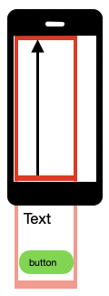

## Android 'UIScrollable' swipe: Simple example

UIScrollable is a powerful Android class that performs element lookups
in scrollable layouts. In most cases you should use "scrollIntoView"
class which performs scroll action until the destination element is
found on the screen.

Android developer
[documentation](https://developer.android.com/reference/androidx/test/uiautomator/UiScrollable)
for UIScrollable.

We can use UIScrollable swipe in following cases:
- search elements in a list (e.g. country list)
- search elements outside of the screen (e.g. input field, text or
  button)

ScrollIntoView has UiSelector as search criteria input that allows you
to find elements by:
- by text (exact, contains, match, starts with or regex)
- id (exact or regex)
- some other methods (rarely used) see in Android developer
  documentation
- a combination of available search methods

Android developer
[documentation](https://developer.android.com/reference/androidx/test/uiautomator/UiSelector)
for UiSelector.

In a simple example we assume that we have one scrolling view and scroll
direction from the bottom to the top of the screen.



### Search by text

```java
// Page object
@AndroidFindBy(uiAutomator = "new UiScrollable(new UiSelector().scrollable(true))" +
        ".scrollIntoView(new UiSelector().text(\"exact_text\"))")
MobileElement element;

@AndroidFindBy(uiAutomator = "new UiScrollable(new UiSelector().scrollable(true))" +
        ".scrollIntoView(new UiSelector().textContains(\"part_text\"))")
MobileElement element;

// FindElement
MobileElement element = (MobileElement) driver.findElement(MobileBy.AndroidUIAutomator(
        "new UiScrollable(new UiSelector().scrollable(true))" +
         ".scrollIntoView(new UiSelector().text(\"exact_text\"))"));

MobileElement element = (MobileElement) driver.findElement(MobileBy.AndroidUIAutomator(
        "new UiScrollable(new UiSelector().scrollable(true))" +
         ".scrollIntoView(new UiSelector().textContains(\"part_text\"))"));
```

### Search by id

```java
// Page object
@AndroidFindBy(uiAutomator = "new UiScrollable(new UiSelector().scrollable(true))" +
        ".scrollIntoView(new UiSelector().resourceIdMatches(\".*part_id.*\"))")
MobileElement element;

// FindElement
MobileElement element = (MobileElement) driver.findElement(MobileBy.AndroidUIAutomator(
        "new UiScrollable(new UiSelector().scrollable(true))" +
         ".scrollIntoView(new UiSelector().resourceIdMatches(\".*part_id.*\"))"));

```

### Search by id and text

```java
// Page object
@AndroidFindBy(uiAutomator = "new UiScrollable(new UiSelector().scrollable(true))" +
        ".scrollIntoView(new UiSelector().resourceIdMatches(\".*part_id.*\").text(\"exact_text\"))")
MobileElement element;

// FindElement
MobileElement element = (MobileElement) driver.findElement(MobileBy.AndroidUIAutomator(
        "new UiScrollable(new UiSelector().scrollable(true))" +
         ".scrollIntoView(new UiSelector().resourceIdMatches(\".*part_id.*\").text(\"exact_text\"))"));

```


### Long view issue

For some longer views it is necessary to increase "setMaxSearchSwipes".
This value allows to set the maximum count of swipe retries made until
the search is stopped.

```java
// set max swipes to 10
// FindElement
MobileElement element = (MobileElement) driver.findElement(MobileBy.AndroidUIAutomator(
        "new UiScrollable(new UiSelector().scrollable(true)).setMaxSearchSwipes(10)" +
         ".scrollIntoView(new UiSelector().text(\"exact_text\"))"));

```

